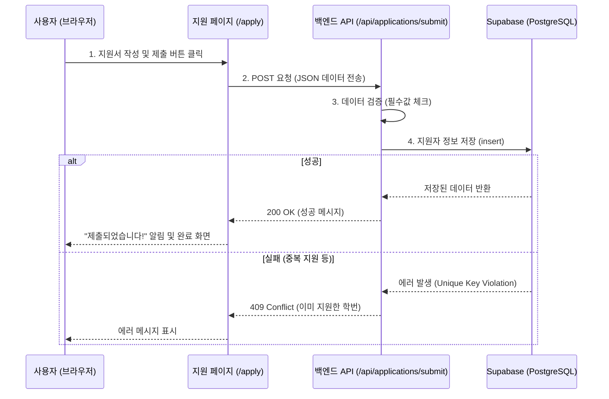
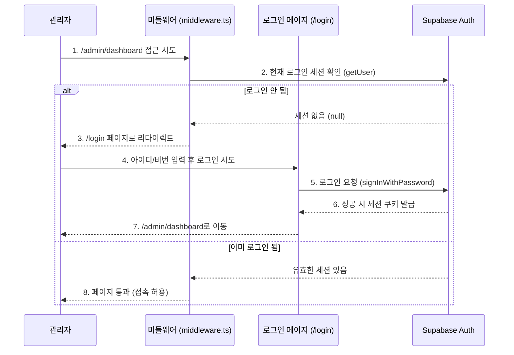
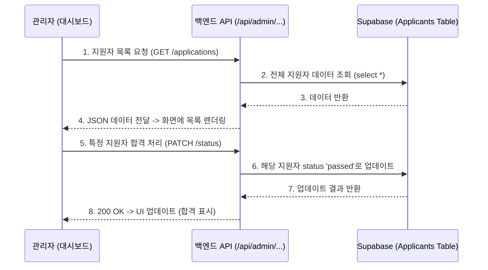

# 📂 프로젝트 구조 및 기능 상세 분석

현재 `cspc-recruit` 프로젝트는 **Next.js 14+ (App Router)** 기반으로 구축되었으며, 별도의 백엔드 서버 없이 **API Routes**와 **Supabase**를 활용한 **Modern Serverless Fullstack** 구조입니다.

---

## 🏗️ 1. 전체 프로젝트 구조

```
cspc-recruit/
├── 📁 app/                 # 핵심 로직 (페이지, API, 컴포넌트 등)
│   ├── 📁 api/             # 백엔드 API 엔드포인트 (서버리스 함수)
│   ├── 📁 lib/             # 유틸리티 및 라이브러리 설정 (Supabase 클라이언트 등)
│   ├── layout.tsx         # 전역 레이아웃
│   └── page.tsx           # 메인 페이지
├── 📜 middleware.ts        # 미들웨어 (요청 가로채기, 리다이렉트)
├── 📜 .env.local           # 환경 변수 (API Key 등)
└── 📜 ...                  # 설정 파일들
```

---

## 🚀 2. 주요 기능 및 데이터 흐름 (Feature Flows)

### 2-1. 지원서 제출 프로세스 (User Flow)
사용자가 지원서를 작성하고 제출하는 핵심 기능입니다.



### 2-2. 관리자 로그인 및 접근 제어 (Auth Flow)
관리자 페이지(`/admin`) 접근 시 인증을 처리하는 흐름입니다.



### 2-3. 지원자 관리 프로세스 (Admin Flow)
관리자가 지원자 목록을 확인하고 합격/불합격 처리를 하는 흐름입니다.



---

## ⚖️ 3. 아키텍처 비교: 현재 방식 vs 전통적 백엔드 방식

| 구분 | **현재 방식 (Next.js + Supabase)** | **전통적 방식 (React + Spring/Node)** |
| :--- | :--- | :--- |
| **구조** | **Monolithic (일체형)**<br>프론트와 백엔드 코드가 하나의 프로젝트에 존재. (Next.js) | **Decoupled (분리형)**<br>프론트 서버(React)와 백엔드 서버(Spring)가 물리적으로 분리됨. |
| **서버 형태** | **Serverless (서버리스)**<br>요청 있을 때만 함수가 실행됨. (Vercel 관리) | **Always On (상시 가동)**<br>EC2 같은 서버에 24시간 프로세스가 떠 있음. |
| **개발 생산성** | **매우 높음 (🚀)**<br>API 하나 만들 때 파일 하나만 추가하면 끝. 타입 공유(TypeScript) 용이. | **보통**<br>API 정의서(Swagger) 만들고, 프론트/백엔드 각각 코드 작성 및 통신 맞춤 필요. |
| **비용** | **사용량 기반 (Pay-as-you-go)**<br>트래픽 없으면 0원. (트래픽 터지면 비용 급증 가능) | **고정 비용**<br>접속자 없어도 서버 켜 둔 시간만큼 비용 발생. |
| **배포 편의성** | **통합 배포**<br>`git push` 한 번이면 프론트+백엔드 동시 배포. | **개별 배포**<br>프론트, 백엔드 따로 빌드하고 배포해야 함. (파이프라인 복잡) |

### ✅ 요약: 왜 이 구조인가?
*   **리크루팅 사이트 특성상**: 특정 기간에만 트래픽이 폭주하고 평소엔 조용합니다. 상시 서버를 켜두는 것보다 **필요할 때만 리소스를 쓰는 서버리스 방식**이 비용과 관리 면에서 압도적으로 유리합니다.
*   **개발 효율성**: 혼자서 프론트부터 DB까지 빠르게 구축하고 수정하기 최적의 구조입니다.
